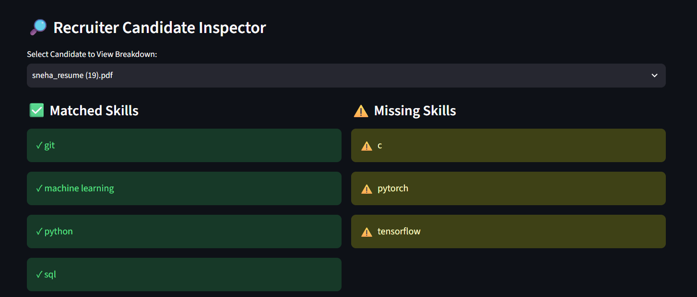

# AI Resume Intelligence & Interview Copilot

An end-to-end resume intelligence platform that analyzes
candidate profiles against job descriptions, extracts
relevant skills, calculates compatibility scores, and
ranks candidates for a specific role.

## 🚀 Features

- Resume parsing
- Email and phone extraction
- Skill extraction
- Job description keyword extraction
- Resume ↔ JD token matching
- Similarity scoring
- Match-score calculation
- Match explanation
- Candidate ranking
- Batch candidate evaluation
- Error handling and logging
- Interactive Streamlit dashboard

## 🏗️ Architecture

Resume
  ↓
Resume Parser
  ↓
Skill Extraction
  ↓
Job Description Parser
  ↓
Keyword Matching
  ↓
Similarity Scoring
  ↓
Candidate Ranking
  ↓
Batch Evaluation
  ↓
Streamlit Dashboard

## 🛠️ Tech Stack

- Python
- Pandas
- SQLite
- Streamlit
- Scikit-learn
- Git & GitHub

## 📂 Project Structure

ai-resume-intelligence-platform/

├── app.py
├── config.py
├── requirements.txt
├── README.md
├── data/
├── src/
└── tests/

## ⚙️ Installation

Clone the repository:

git clone <your-repository-url>

Create an environment:

python -m venv .venv

Activate the environment.

Install dependencies:

pip install -r requirements.txt

## ▶️ Run the Application

streamlit run app.py

## 📊 Pipeline

1. Upload resumes
2. Parse candidate information
3. Upload/select a job description
4. Extract JD keywords
5. Match candidate skills
6. Calculate match scores
7. Rank candidates
8. Review candidate explanations

## 🧪 Testing

The project contains day-by-day testing scripts covering:

- Resume parsing
- Feature engineering
- Scoring
- JD parsing
- Matching
- Ranking
- Batch evaluation
- Error handling
- End-to-end integration

## 🎯 Project Goal

The goal of this project is to build an engineering-focused
resume intelligence system that demonstrates practical
application of data processing, NLP-style text matching,
scoring systems, backend logic, and interactive deployment.

## 🎯 Project Highlights

This project demonstrates an end-to-end candidate intelligence
pipeline built around modular data processing and text matching.

### Core capabilities

- Resume information extraction
- Skill extraction
- Job description parsing
- Resume-to-JD keyword matching
- Similarity scoring
- Match-score calculation
- Explainable match results
- Candidate ranking
- Batch candidate evaluation
- Edge-case handling
- Logging
- Interactive Streamlit interface

## 🔄 End-to-End Workflow

```text
Candidate Resumes
        │
        ▼
   File Handler
        │
        ▼
   Resume Parser
        │
        ├── Email
        ├── Phone
        └── Skills
        │
        ▼
Job Description Parser
        │
        ▼
Keyword Matching
        │
        ▼
Similarity Scoring
        │
        ▼
Match Score
        │
        ▼
Candidate Ranking
        │
        ▼
Batch Evaluation
        │
        ▼
Streamlit Dashboard

## 🖥️ Application Preview

### Dashboard


### Candidate Leaderboard


### Candidate Analysis



## ⚠️ Current Limitations

- Resume parsing currently depends on the supported input formats
  and extraction rules.
- Matching is primarily based on extracted skills and textual
  similarity.
- Semantic understanding of equivalent skills is limited.
- Candidate scoring is a deterministic baseline rather than a
  learned hiring model.
- The current system does not replace human recruitment decisions.

## 🔮 Future Improvements

Potential extensions include:

- Transformer-based semantic resume matching
- Better PDF/DOCX extraction
- Experience-level extraction
- Education matching
- Entity recognition for organizations and technologies
- Learned candidate-job ranking models
- Explainable scoring improvements
- Persistent production database
- Authentication and role-based access
- Cloud deployment

## 🗺️ Development Roadmap

| Phase | Days | Focus |
|---|---:|---|
| Foundation | 1–10 | Parsing, validation and database |
| Data Pipeline | 11–20 | Processing and application foundation |
| Feature Engineering | 21–30 | Candidate features and scoring |
| Intelligence Layer | 31–40 | Candidate scoring and platform improvements |
| Job Matching | 41–46 | JD parsing, matching and ranking |
| Reliability | 47–48 | Error handling and integration |
| Portfolio | 49–50 | UI, documentation and finalization |

## ✅ Project Status

**Completed — 50-Day Engineering Project**

The current version includes the complete resume-to-job
matching pipeline, batch candidate evaluation, ranking,
error handling, Streamlit interface, and project documentation.

## 👩‍💻 Author

Sneha Kumari

B.Tech — Electronics & Communication Engineering